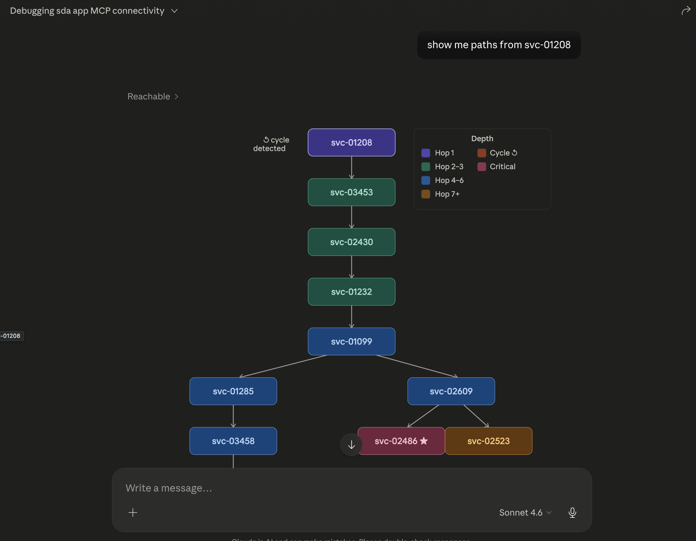

# Service Dependency Analyzer

In-memory directed graph of service dependencies, fed by a custom event queue, with REST queries for blast radius, reverse dependencies, shortest path, criticality, cycles, and health.

Architecture details: [`REPORT.md`](./REPORT.md). Module-level tour: [`CLAUDE.md`](./CLAUDE.md).

---

## From a fresh clone to a running service

Copy-paste these in order. Each step is independently useful — stop wherever you have what you need.

### 1. Start it

```bash
docker compose up -d
```

That builds the SDA image, the MCP sidecar, and starts both. No JDK needed locally. (Java path: `./gradlew bootRun` instead — Gradle wrapper auto-provisions Java 21.)

### 2. Wait for healthy

```bash
docker compose ps
# wait until `sda` shows (healthy) — about 10s
```

### 3. Confirm the API answers

```bash
curl -sS http://localhost:8080/actuator/health
# {"status":"UP"}
```

The synthetic generator runs at boot and seeds **~5 000 services and ~100 000 events** with planted cycles and hot edges, so the queries below already have data.

### 4. Run a query

```bash
curl -sS 'http://localhost:8080/api/v1/graph/critical-services?k=5' | jq .
```

```json
{
  "k": 5,
  "services": [
    {"id": "db-primary",   "score": 84.0, "inDegree": 12, "outDegree": 7},
    {"id": "auth-service", "score": 50.0, "inDegree": 10, "outDegree": 5}
  ]
}
```

### 5. Push your own event

```bash
curl -sS -X POST http://localhost:8080/api/v1/events \
  -H 'Content-Type: application/json' \
  -d '{"type":"dependency_observed","event_id":"e-1","timestamp":"2026-05-10T12:00:00Z","source":"checkout","target":"payments","latency_ms":42,"status":"ok"}'
# 202 Accepted
```

The event is in the graph by the time the response returns. Verify:

```bash
curl -sS http://localhost:8080/api/v1/graph/reachable/checkout | jq .
```

### 6. Stop everything

```bash
docker compose down
```

State persists on the `sda-data` volume — restart with `docker compose up -d` to pick up where you left off.

---

## Browse the API

```
http://localhost:8080/swagger-ui.html
```

…or hit each endpoint directly:

| Endpoint | Returns |
|---|---|
| `GET /api/v1/graph/reachable/{service}` | Every service downstream of `{service}`, with one path each. |
| `GET /api/v1/graph/dependents/{service}` | Reverse — every service that transitively depends on `{service}`. |
| `GET /api/v1/graph/shortest-path?source=&target=` | Lowest-latency path (Dijkstra over rolling-avg latencies). |
| `GET /api/v1/graph/critical-services?k=` | Top-k by criticality score (in-degree × out-degree). |
| `GET /api/v1/graph/cycles` | Every elementary cycle currently in the graph. |
| `GET /api/v1/graph/health/{service}?windowSeconds=` | Error rate + p95 over a trailing window. |
| `POST /api/v1/events` | Publish one event. |
| `POST /api/v1/events/batch` | Publish many. |

Errors come back as `{"error": "...", "message": "...", "service": "..."}` — never a stack trace.

| HTTP | `error` | When |
|---|---|---|
| 404 | `service_not_found` | Service id not in the graph. |
| 400 | `invalid_request` | Bad params (`k <= 0`, `windowSeconds > retention`, malformed JSON). |
| 503 | `service_unavailable` | Queue partition full at ingest, or shutdown in progress. |

### Event types

| Type | Required (besides `event_id`/`timestamp`) | Effect |
|---|---|---|
| `dependency_observed` | `source`, `target`, `latency_ms`, `status` (`ok`/`error`/`timeout`) | Adds (or refreshes) edge `source → target` and contributes a sample. |
| `dependency_removed` | `source`, `target` | Removes the edge if present. Tolerant to "edge unknown". |
| `service_metadata` | `service`, `attributes` (`Map<String,String>`; `team`/`tier`/`region` recognized) | Updates that service's metadata. |
| `heartbeat` | `service` | Stamps `last_heartbeat_ts`. |

---

## (Optional) LLM tool access via MCP

The `mcp/` folder ships a TypeScript MCP server that exposes the six read queries as tools an LLM client (Claude Desktop / Claude Code) can call. The compose stack already builds and runs it as the `sda-mcp` sidecar. Wire your client at `docker exec -i sda-mcp node /app/dist/index.js` (full snippets in [`mcp/README.md`](./mcp/README.md)).

Once wired, you can ask Claude things like *"show me the paths from svc-01208"* and it'll call `reachable` for you and visualize the result:



---

## Drive your own data instead of the synthetic generator

The synthetic generator is on by default. Turn it off if you want an empty graph that only reflects what you POST:

```bash
# Docker:
echo 'SDA_EVENTS_GENERATOR_ENABLED=false' >> .env   # docker-compose reads it
docker compose up -d --force-recreate

# Bare metal:
./gradlew bootRun --args='--sda.events.generator.enabled=false'
```

---

## Build and test

```bash
./gradlew build       # compile + run all tests
./gradlew test        # tests only
./gradlew bootJar     # runnable jar at build/libs/service-dependency-analyzer-0.1.0-SNAPSHOT.jar
```

End-to-end fixture harness (boots the bootJar, POSTs each fixture, diffs the API response):

```bash
./gradlew bootJar
bash scripts/run_fixture_tests.sh                    # all fixtures
bash scripts/run_fixture_tests.sh topology/02-diamond  # filter
```

---

## Configuration

All under the `sda.*` namespace in `src/main/resources/application.yml`. Override on the command line as `--sda.foo.bar=value`.

### Ingest

| Key | Default | Purpose |
|---|---|---|
| `sda.ingest.producer-count` | `2` | Internal producer threads. |
| `sda.ingest.consumer-count` | `2` | Consumer threads. **Also the number of queue partitions** — events for one `(source, target)` pair always land in the same partition (per-edge serial ordering). |
| `sda.ingest.queue-capacity` | `10000` | Bounded capacity *per partition*. |
| `sda.ingest.put-timeout-ms` | `0` (block) | When `> 0`, internal producers shed-with-counter on timeout instead of blocking. HTTP ingest always uses a 1 s timed offer (returns 503 on timeout). |
| `sda.ingest.dedup-cache-capacity` | `200000` | Sizing hint for `SeenEventsCache`. |
| `sda.ingest.close-queue-on-generator-exhaust` | `false` | When `true`, the queue closes after the synthetic generator exits — useful for short CLI/test runs that should terminate. |

### Health window

| Key | Default | Purpose |
|---|---|---|
| `sda.health.window-seconds` | `300` | Default trailing window for `health()`; also caps in-memory sample retention. |
| `sda.health.max-samples-per-edge` | `1024` | Hard cap on the per-edge sample deque. |

### Synthetic generator

| Key | Default | Purpose |
|---|---|---|
| `sda.events.generator.enabled` | `true` | Master switch. |
| `sda.events.generator.service-count` | `5000` | Distinct service ids fabricated. |
| `sda.events.generator.event-count` | `100000` | Total events. |
| `sda.events.generator.hub-count` | `8` | High-fan-in services. |
| `sda.events.generator.cycles-to-inject` | `3` | Explicit cycles seeded. |
| `sda.events.generator.error-rate` | `0.05` | Fraction of non-OK observations. |
| `sda.events.generator.duplicate-rate` | `0.01` | Fraction of exact replays (drives dedup). |
| `sda.events.generator.seed` | `42` | RNG seed. |

### Database

`jdbc:sqlite:./data/graph.db`. WAL mode is enabled at boot. Hikari pool size is sized programmatically to `consumer-count + 5` (so it never undersizes relative to consumers). A `@Scheduled` task prunes `edge_samples` older than `health.window-seconds` once a minute. The DB *is* the snapshot — no separate snapshot cadence.

---

## Assumptions and constraints

What the defaults bake in. Worth knowing if you push the system somewhere unusual.

- **Single JVM.** Producers, queue, consumers, graph, API — all in one process. Horizontal scaling is future work; see `REPORT.md`.
- **SQLite is the persisted state.** Tables are the snapshot; we don't keep an event log. Boot replays rows back into the in-memory graph; ingestion resumes from there.
- **Backpressure default is BLOCK.** A silently dropped `dependency_removed` would corrupt the graph for the rest of the run. Set `sda.ingest.put-timeout-ms > 0` if you'd rather shed deliberately.
- **Out-of-order tolerance is last-write-wins by event timestamp**, scoped to removal boundaries. A stale observation arriving after a removal is rejected via in-memory tombstones; a stale removal is rejected via the edge's `lastObservedTs`. Same-edge observations land in any order — rolling avg is order-independent.
- **Tombstones are in-memory only.** They survive the JVM but not a restart. `last_observed_ts` *is* persisted on `edges`, so post-restart stale removals on surviving edges are still rejected.
- **Idempotency is two-layer**: atomic `tryClaim` in-memory + `processed_events` PK constraint on disk. Race-free within one JVM, durable across restarts.
- **Cycles are reported as elementary cycles**, sorted by length then lex. Self-loops emit `[v, v]`.
- **Critical-services metric is `inDegree(v) × outDegree(v)`** — a hybrid chosen for `O(V)` cost over Brandes' `O(V·E)` betweenness. Ties broken by id (lex). See `REPORT.md` for the trade-off.
- **No persistent event log.** A JVM crash between in-memory mutation and DB commit drops one event. The synthetic generator doesn't re-deliver and the queue isn't durable. At-least-once would require a durable upstream (Kafka), which the spec forbids.
- **Java 21 + Spring Boot 3.3.x.** Producers and consumers run on virtual threads.
